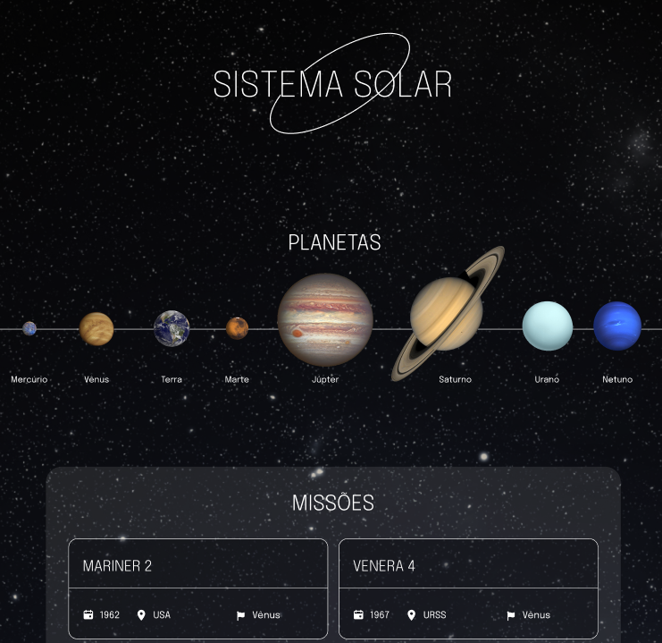

<h1><strong>Solar System</strong></h1>

<h2><strong>Descrição</strong></h2>

  O Solar System simula um modelo simplificado do Sistema Solar e nela a pessoa usuária pode visualizar todos os planetas renderizados na tela e acessar cartas com informações sobre diferentes missões espaciais.

<h2><strong>Demonstração do Projeto</strong></h2>

  
   
  <a href="https://github.com/williandpg/solar-system" target="_blank"><strong>Acesse a demonstração</strong></a>

<h2><strong>Tecnologias Utilizadas</strong></h2>
<ul>
  <li align="justify">
    <a href="https://react.dev/" target="_blank"><strong>React</strong></a>:
    Biblioteca JavaScript utilizada para construção dos componentes de interface e organização da aplicação.
  </li>
  <li align="justify">
    <a href="https://developer.mozilla.org/pt-BR/docs/Web/JavaScript" target="_blank"><strong>JavaScript</strong></a>:
    Linguagem base para a lógica da aplicação, manipulação de arrays de dados e criação dos componentes.
  </li>
  <li align="justify">
    <a href="https://developer.mozilla.org/pt-BR/docs/Web/HTML" target="_blank"><strong>HTML</strong></a>:
    Estrutura semântica da aplicação, definida através do JSX.
  </li>
  <li align="justify">
    <a href="https://developer.mozilla.org/pt-BR/docs/Web/CSS" target="_blank"><strong>CSS</strong></a>:
    Estilização da interface, definindo layout e aparência dos planetas e cartas de missão.
  </li>
  <li align="justify">
    <a href="https://www.npmjs.com/package/prop-types" target="_blank"><strong>PropTypes</strong></a>:
    Biblioteca usada para validação de tipos das props dos componentes React.
  </li>
</ul>

<h2><strong>Estrutura do Projeto</strong></h2>

A estrutura do projeto é organizada de forma simples para facilitar a leitura e manutenção:

<pre><code>/
├── examples/                 # Exemplos dos componentes em uso
├── src/
│   ├── components/           # Componentes React da aplicação
│   ├── data/                 # Dados dos planetas e missões
│   ├── images/               # Imagens utilizadas na aplicação
│   ├── tests/                # Testes dos componentes
│   ├── App.tsx
│   ├── App.css
│   ├── main.tsx
│   └── vite-env.d.ts
├── index.html
└── README.md
</code></pre>

<h2><strong>Contato</strong></h2>

  <strong>Willian Gonçalves</strong> |
  <a href="https://www.linkedin.com/in/williandpg/" target="_blank"><strong>LinkedIn</strong></a> |
  <a href="https://github.com/williandpg" target="_blank"><strong>Github</strong></a> |
  <a href="https://williandpg.github.io/" target="_blank"><strong>Portfólio</strong></a> |
  <a href="mailto:goncalves.wdp@outlook.com" target="_blank"><strong>Email</strong></a>

<h2><strong>Créditos</strong></h2>

  Este projeto foi desenvolvido como parte das atividades avaliativas do curso de Desenvolvimento Web Full Stack da Trybe, na seção de Introdução ao React.

  
<strong>English Version</strong>

  <h1><strong>Solar System</strong></h1>

  <h2><strong>Description</strong></h2>
  

    Solar System is an application that simulates a simplified model of our Solar System.
    Users can see all planets rendered on the screen and browse cards with information about different space missions.
  

  <h2><strong>Project Demonstration</strong></h2>
  

    
     
    <a href="https://github.com/williandpg/solar-system" target="_blank"><strong>Access the demonstration</strong></a>
  

  <h2><strong>Technologies Used</strong></h2>
  <ul>
    <li align="justify">
      <a href="https://react.dev/" target="_blank"><strong>React</strong></a>:
      Library used to create and organize the UI components.
    </li>
    <li align="justify">
      <a href="https://developer.mozilla.org/en-US/docs/Web/JavaScript" target="_blank"><strong>JavaScript</strong></a>:
      Language used for the application logic and array handling.
    </li>
    <li align="justify">
      <a href="https://developer.mozilla.org/en-US/docs/Web/HTML" target="_blank"><strong>HTML</strong></a>:
      Semantic structure for the pages, defined through JSX.
    </li>
    <li align="justify">
      <a href="https://developer.mozilla.org/en-US/docs/Web/CSS" target="_blank"><strong>CSS</strong></a>:
      Styling for layout and visual presentation of planets and missions.
    </li>
    <li align="justify">
      <a href="https://www.npmjs.com/package/prop-types" target="_blank"><strong>PropTypes</strong></a>:
      Library used for props validation in React components.
    </li>
  </ul>

  <h2><strong>Project Structure</strong></h2>
  
The project structure is organized as follows:

  <pre><code>/
  ├── examples/                 # Examples of components in use
  ├── src/
  │   ├── components/           # React components of the application
  │   ├── data/                 # Data of planets and missions
  │   ├── images/               # Images used in the application
  │   ├── tests/                # Component tests
  │   ├── App.tsx
  │   ├── App.css
  │   ├── main.tsx
  │   └── vite-env.d.ts
  ├── index.html
  └── README.md
  </code></pre>

  <h2><strong>Contact</strong></h2>
  

    <strong>Willian Gonçalves</strong> |
    <a href="https://www.linkedin.com/in/williandpg/" target="_blank"><strong>LinkedIn</strong></a> |
    <a href="https://github.com/williandpg" target="_blank"><strong>Github</strong></a> |
    <a href="https://williandpg.github.io/" target="_blank"><strong>Portfolio</strong></a> |
    <a href="mailto:goncalves.wdp@outlook.com" target="_blank"><strong>Email</strong></a>
  

  <h2><strong>Credits</strong></h2>
  

    This project was developed as part of the Full Stack Web Development course at Trybe, within the Introduction to React module.
  

